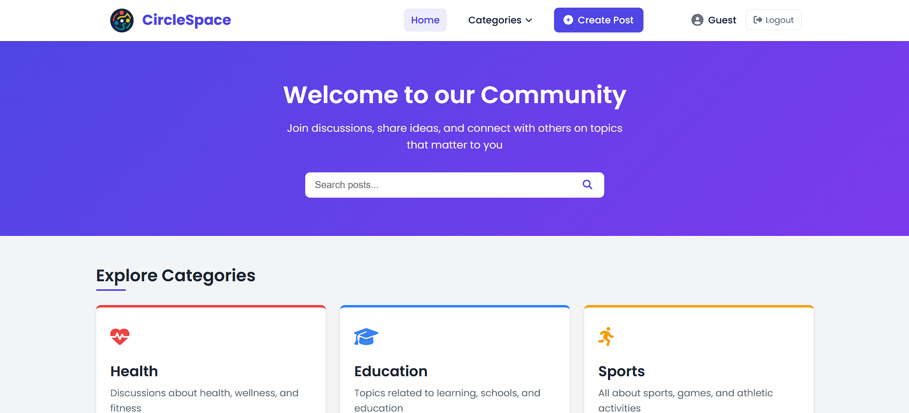
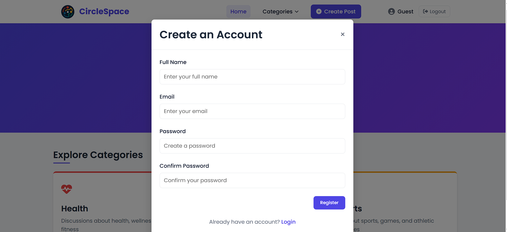
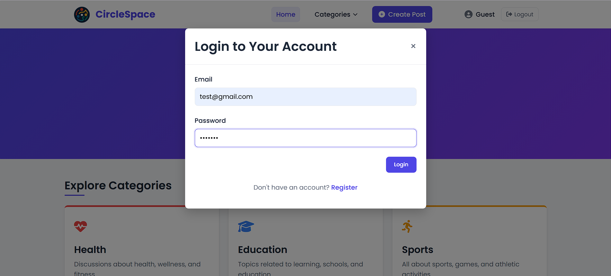
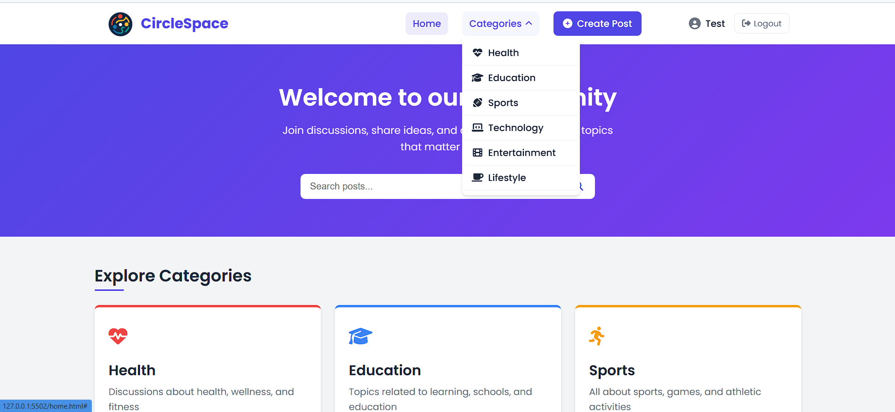
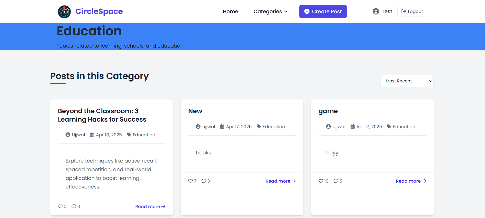
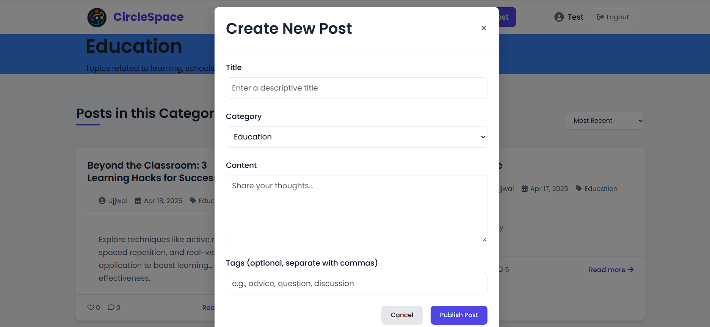

# CircleSpace

## Introduction
CircleSpace is a social networking application that allows users to register, login, and interact with posts across different categories. Users can create posts, like, comment, and share content with others. The platform provides a clean, intuitive interface for community engagement organized by topics of interest.

## Project Type
Fullstack

## Deployed App
Frontend: https://circle-spacee.netlify.app/
Backend: Firebase Services
Database: Firebase Firestore

## Directory Structure
```
community-platform/
├─ home.html
├─ search.html
├─ category.html
├─ circlespace-logo.png
├─ styles.css
├─ home.js
├─ search.js
├─ category.js
├─ auth.js
```

## Video Walkthrough of the project
[Video Demo Link](https://youtu.be/xzKS6aDJMJE) (1-3 minutes)

## Video Walkthrough of the QNA
[QNA Walkthrough Link](https://youtu.be/RE4dCV8QKCc) (1-5 minutes)

## Features
- User authentication (registration and login)
- Category-based content organization (Health, Education, Sports, Technology, Entertainment, Lifestyle)
- Post creation with category selection
- Interactive post engagement (like, comment, share)
- Responsive design for all device sizes
- Real-time updates for posts and comments
- User profile display

## Design Decisions & Assumptions
- **Firebase Integration**: Used Firebase for authentication and database to simplify backend development
- **Single Page Application Structure**: Each major function has its own HTML page for simplicity
- **Category System**: Implemented a fixed set of categories for content organization
- **Responsive Design**: Mobile-first approach to ensure usability across devices
- **Modular JavaScript**: Separated functionality into different JS files for maintainability
- **Assumed Requirements**:
  - Users need to be authenticated to interact with content
  - Categories are predefined and not user-created
  - Basic social features (like, comment, share) are sufficient for MVP

## Installation & Getting Started
1. Clone the repository
2. Set up a Firebase project at [Firebase Console](https://console.firebase.google.com/)
3. Enable Authentication (Email/Password) and Firestore Database
4. Replace Firebase configuration in `firebase-config.js` with your own credentials

## Usage

1. Open the application in your browser
2. Register a new account on the registration page
3. Login with your credentials
4. Browse categories on the home page
5. Click on a category to view related posts
6. Create new posts using the "Create Post" button
7. Interact with posts by liking, commenting, or sharing

```bash
# Clone the repository
git clone https://github.com/Adarsh287/Circle-Space.git
cd Circle-Space

# If using a local server like live-server
npm install -g live-server
live-server

```
## Screenshots









## Credentials

For testing purposes:

- Email: [test@gmail.com]
- Password: test123


## APIs Used

- Firebase Authentication API
- Firebase Firestore API


## API Endpoints

Since this project uses Firebase, it doesn't have traditional REST API endpoints. Instead, it interacts with Firebase services:

- **Authentication**:

- `createUserWithEmailAndPassword()` - Register new user
- `signInWithEmailAndPassword()` - Login user
- `signOut()` - Logout user


- **Firestore Database**:

- `collection("users").doc(uid).set()` - Create user profile
- `collection("posts").add()` - Create new post
- `collection("posts").where("category", "==", category)` - Get posts by category
- `collection("comments").add()` - Add comment to post
- `doc("posts", postId).update()` - Update post (likes, comments count)


## Technology Stack

- **Frontend**: HTML5, CSS3, JavaScript (ES6+)
- **Backend**: Firebase Authentication, Firebase Firestore
- **Database**: Firebase Firestore
- **Hosting**: Firebase Hosting (assumed)
- **Other Tools/Libraries**:

- Firebase SDK
- Font Awesome (for icons)
